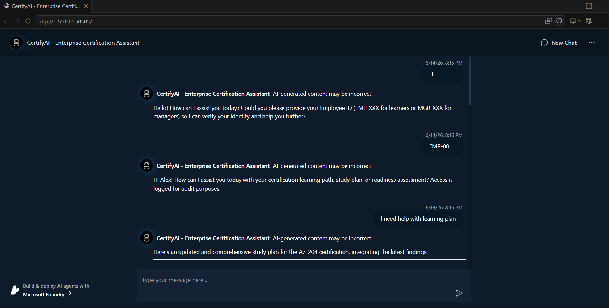
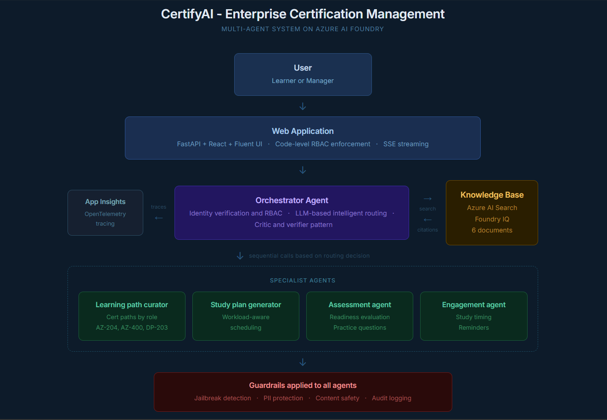

# CertifyAI - Enterprise Learning and Certification Management

> Agents League Hackathon 2026 | Reasoning Agents Track | Built on Microsoft Azure AI Foundry

CertifyAI is an intelligent multi-agent system that helps enterprise employees and managers navigate certification learning paths, study planning, readiness assessment, and engagement strategy. It is grounded in organizational knowledge data and enforces role-based access control through agent reasoning.

---

## Demo




**Demo Flow:**
1. User identifies themselves with Employee ID (EMP-XXX for learners, MGR-XXX for managers)
2. System verifies identity against Employee Directory in the knowledge base
3. Orchestrator routes request to relevant specialist agents via LLM-based routing
4. Each specialist agent retrieves grounded data from Azure AI Search
5. Final synthesized response delivered with named knowledge base citations

---

## Architecture



### How it works

The user interacts with a FastAPI web application that enforces RBAC in code before any agent is called. The orchestrator agent handles identity verification and uses LLM-based reasoning to decide which specialist agents to invoke. Specialist agents are called sequentially, each building on the previous agent's findings, and all are grounded via Azure AI Search (Foundry IQ). Application Insights captures traces from all layers via OpenTelemetry.

### Microsoft Technologies Used

| Component | Technology |
|-----------|-----------|
| Agent platform | Azure AI Foundry Agent Service |
| Knowledge base | Azure AI Search (Foundry IQ) |
| Model | GPT-4o |
| Observability | Application Insights + OpenTelemetry |
| Web app | FastAPI + React + Fluent UI |
| Auth | Azure CLI Credential / DefaultAzureCredential |

---

## Key Features

### Multi-Agent Sequential Orchestration
The orchestrator uses LLM-based intelligent routing to decide which specialist agents to invoke based on the user query. Simple queries invoke one agent. Complex queries chain multiple agents sequentially, each building on the previous agent's findings.

### Foundry IQ Knowledge Grounding
All specialist agents are connected to an Azure AI Search index containing six synthetic enterprise documents. Every response is grounded with named citations from the knowledge base.

Knowledge base documents:
- Engineering Certification Enablement Guide
- Learner Performance Data
- Work Activity Signals
- Workload Insights Report
- Team Learning Report
- Employee Directory and Access Rules

### Role-Based Access Control (RBAC)
Identity is verified at the start of every conversation. The authorized employee ID is stored in conversation metadata. All subsequent requests are checked in code before reaching any agent. Learners can only access their own data. Managers receive anonymized team-level aggregates. Access violations are blocked immediately with an audit log entry.

### Critic and Verifier Pattern
The orchestrator runs a self-verification step before returning any answer, checking for unsupported claims, incorrect risk classifications, unauthorized data exposure, and exam outcome promises.

### Responsible AI Guardrails
All six agents have content safety filters configured:
- Jailbreak detection
- Indirect prompt injection protection
- PII detection (email, phone, passport, government IDs)
- Content harm blocking (hate, sexual, self-harm, violence)
- Task drift detection
- Audit logging on every response

### Evaluation Results

```
Overall score : 87%
Tests passed  : 8 / 8
Accuracy      : 93/100
Reasoning     : 87/100
Safety        : 80/100
```

---

## Agent Roles

| Agent | Responsibility |
|-------|---------------|
| orchestrator-agent | Entry point, RBAC enforcement, LLM-based routing, Critic and Verifier |
| learning-path-curator | Certification paths by role (AZ-204, AZ-400, DP-203 etc.) |
| study-plan-generator | Capacity-aware weekly study schedules |
| assessment-agent | Readiness evaluation with practice questions |
| engagement-agent | Study timing, reminders, escalation strategy |
| manager-insights-agent | Anonymized team-level certification readiness |

---

## Risk Classification

| Risk Level | Criteria |
|-----------|---------|
| HIGH RISK | Focus hours below 10 OR study hours below 15 OR practice score below 65 |
| MODERATE RISK | Focus hours below 12 OR study hours below 20 OR practice score below 75 |
| LOW RISK | All thresholds met |

HIGH RISK employees are automatically flagged for manager review.

---

## Local Development

### Prerequisites

- Python 3.11+
- Node.js 18+
- pnpm
- Azure CLI
- Azure AI Foundry project with GPT-4o deployment

### Setup

```bash
git clone https://github.com/serasr/certifyai-enterprise-certification-agent.git
cd certifyai-enterprise-certification-agent

python -m venv .venv
.venv\Scripts\activate

pip install -r src/requirements.txt

cd src/frontend
pnpm install
pnpm run build
cd ../..
```

### Environment Variables

Create `.azure/enterprise-cert-agent/.env`:

```
AZURE_EXISTING_AIPROJECT_ENDPOINT=<your-foundry-project-endpoint>
AZURE_EXISTING_AGENT_ID=orchestrator-agent:<version>
AZURE_AI_AGENT_DEPLOYMENT_NAME=gpt-4o
AZURE_SEARCH_ENDPOINT=<your-search-endpoint>
AZURE_SEARCH_ADMIN_KEY=<your-search-admin-key>
AZURE_SEARCH_KB_NAME=cert-knowledge-base
ENABLE_AZURE_MONITOR_TRACING=true
```

### Run

```bash
az login --tenant <your-tenant-id>
cd src
python -m uvicorn api.main:create_app --factory --reload --port 50505
```

Open `http://127.0.0.1:50505`

### Run Evaluation

```bash
python tests/evaluate_agent.py --verbose --output results/eval_report.json
```

---

## Known Limitations and Platform Bugs

### MCP 403 Error on Azure AI Search Knowledge Base
**Issue:** Foundry Agent Service MCP tool enumeration fails with HTTP 403 against Azure AI Search knowledge bases.

**Workaround:** Switched from MCP knowledge base connection to the native Azure AI Search tool. All agents are grounded via Azure AI Search directly.

### A2A 401 PermissionDenied Between Foundry Agents
**Issue:** Agent-to-agent calls via the A2APreviewTool return HTTP 401 even with correct Foundry User role assigned. This is a platform-level bug in the Foundry Agent Service preview.

**Workaround:** Sequential Responses API calls from Python code, passing each agent's output as context to the next. This achieves the same multi-agent chain without relying on A2A.

### KB Source Mapping
**Note:** Citation markers from Azure AI Search are mapped to human-readable source names via a dictionary in `routes.py`. In production this should be resolved dynamically from the search index metadata.

### Identity Verification via Employee ID (Demo Simplification)
**Current behaviour:** The system accepts a self-reported Employee ID (EMP-XXX or MGR-XXX) from the user and verifies it against the Employee Directory in the knowledge base. Access control is then enforced based on this ID for the remainder of the session.

**Production recommendation:** In a production enterprise deployment, the Employee ID input should trigger a redirect to the corporate identity provider (Azure Active Directory / Entra ID) for proper authentication. The verified identity from the OAuth/OIDC token should be used to determine the employee's role and access level, rather than relying on self-reported input. This would eliminate the possibility of a user claiming a different employee's ID to attempt unauthorized access.

---

## Costs

- **Microsoft Foundry:** Free tier. [Pricing](https://azure.microsoft.com/pricing/details/ai-studio/)
- **Azure AI Search:** Free tier. [Pricing](https://azure.microsoft.com/pricing/details/search/)
- **Azure OpenAI (GPT-4o):** Pay-per-token. [Pricing](https://azure.microsoft.com/pricing/details/cognitive-services/openai-service/)
- **Application Insights:** Pay-as-you-go. [Pricing](https://azure.microsoft.com/pricing/details/monitor/)

---

## Security

This solution uses Azure CLI Credential for local development. For production:

- Use Managed Identity instead of CLI credentials
- Enable Microsoft Defender for Cloud
- Restrict access with Azure Virtual Network
- Store the Azure AI Search Admin Key in Azure Key Vault
- Enable GitHub secret scanning on your repository

---

## Resources

| Resource | Description |
|----------|-------------|
| [Azure AI Foundry Agent Service](https://learn.microsoft.com/azure/ai-foundry/agents/) | Hosted agent runtime with tools and knowledge |
| [Azure AI Search](https://learn.microsoft.com/azure/search/) | Knowledge base for grounded responses |
| [Application Insights](https://learn.microsoft.com/azure/azure-monitor/app/app-insights-overview) | Tracing and observability |
| [Microsoft Agent Framework](https://github.com/microsoft/agent-framework) | Sequential multi-agent orchestration |

---

## Disclaimers

This solution uses synthetic data for demonstration purposes only. No real employee data is used or stored.

To the extent that the Software includes components or code used in or derived from Microsoft products or services, you must comply with the Product Terms applicable to such Microsoft Products and Services. See transparency documents for [Agent Service](https://learn.microsoft.com/azure/ai-foundry/responsible-ai/agents/transparency-note) and [Agent Framework](https://github.com/microsoft/agent-framework/blob/main/TRANSPARENCY_FAQ.md).

BY ACCESSING OR USING THE SOFTWARE, YOU ACKNOWLEDGE THAT THE SOFTWARE IS NOT DESIGNED OR INTENDED TO SUPPORT ANY USE IN WHICH A SERVICE INTERRUPTION, DEFECT, ERROR, OR OTHER FAILURE OF THE SOFTWARE COULD RESULT IN THE DEATH OR SERIOUS BODILY INJURY OF ANY PERSON OR IN PHYSICAL OR ENVIRONMENTAL DAMAGE, AND THAT YOU WILL ENSURE THAT THE SAFETY OF PEOPLE, PROPERTY, AND THE ENVIRONMENT ARE NOT REDUCED BELOW A LEVEL THAT IS REASONABLY APPROPRIATE AND LEGAL.
